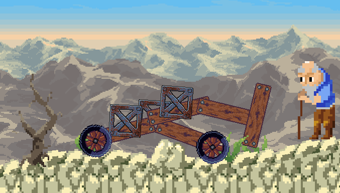
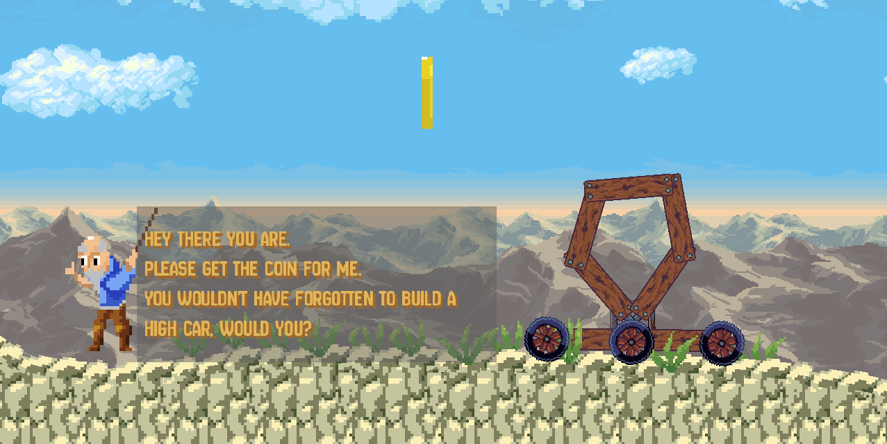
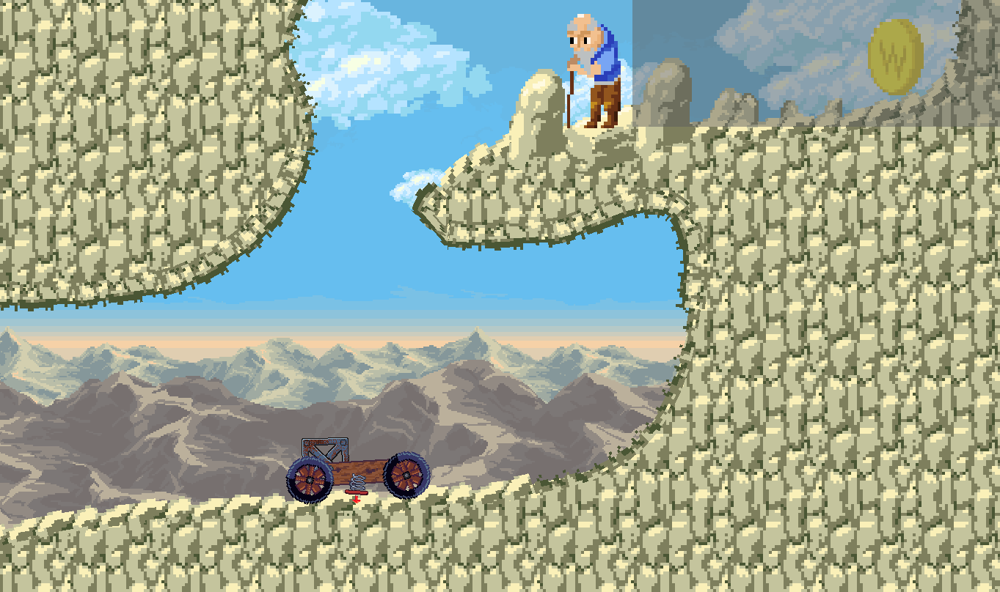
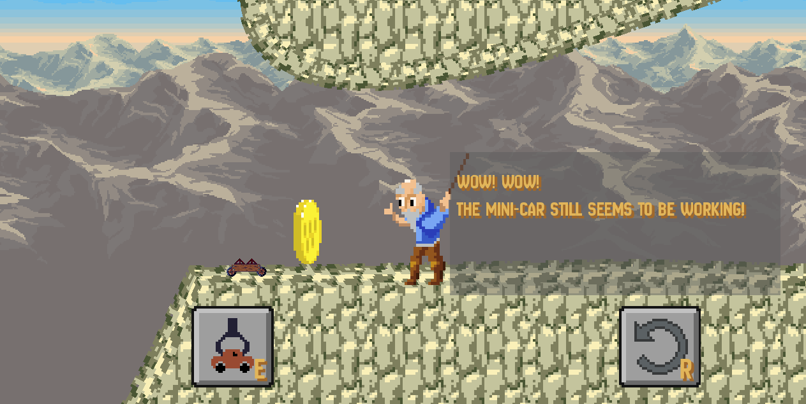
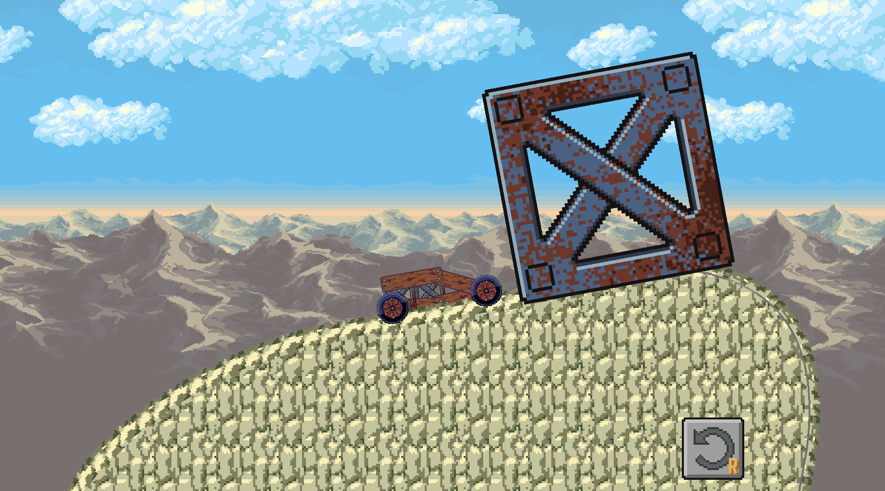
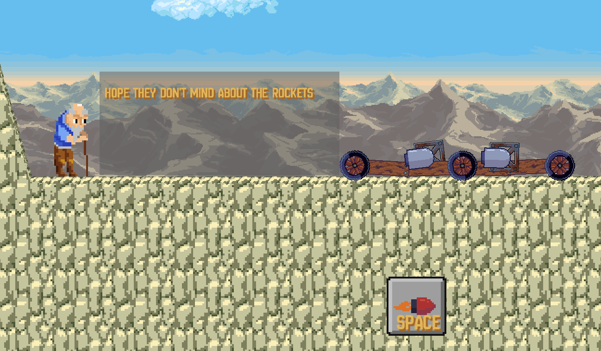

<h1 align=center>Grandpa's Hill Racer</h1>

[Try it here on itch.io!](https://liquidfun.itch.io/grandpas-hill-racer)

It's time to visit Grandpa. Construct a vehicle from scrap part and make your way up the mountain!

Created as part of GMTK 2024 in around 48 hours. The theme was "Built to Scale".

# Credits 

## Used plugins

- smartshape2D
- Rapier2D

## Art

- Background from https://szadiart.itch.io/

## Sound

- Car engine: https://pixabay.com/sound-effects/car-sound-effect-126709/
- Mouse Click : https://pixabay.com/sound-effects/mouse-click-117076/
- "hit by a wood": https://pixabay.com/sound-effects/hit-by-a-wood-230542/
- "game music teste" music: https://pixabay.com/music/video-games-game-music-teste-204327/
- https://pixabay.com/sound-effects/sound-effect-for-games-131029/
- https://pixabay.com/sound-effects/wrong-47985/
